<p align="center">
  
</p>

<h1 align="center">gansi-rs</h1>

<p align="center">
  <strong>Local AMSI telemetry for Windows — research-grade, operator-owned, written in Rust.</strong>
</p>

<p align="center">
  <a href="https://github.com/anubhavg-icpl/gansi-rs"></a>
  
  
  
  
</p>

<p align="center">
  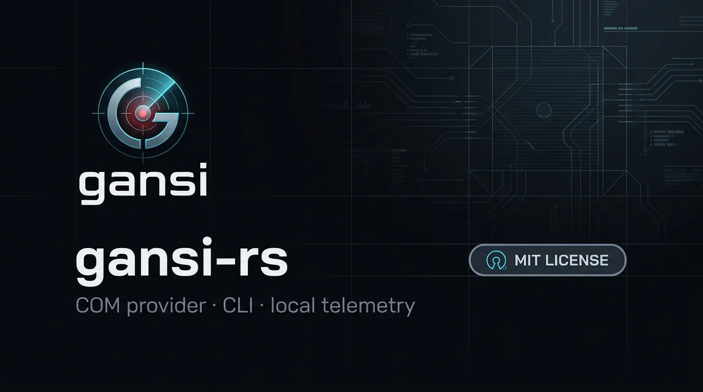
</p>

---

## Table of contents

1. [Executive summary](#executive-summary)
2. [What Gansi is (and is not)](#what-gansi-is-and-is-not)
3. [What you can achieve](#what-you-can-achieve)
4. [Brand & identity](#brand--identity)
5. [Product surfaces](#product-surfaces)
6. [Architecture](#architecture)
7. [Workspace layout](#workspace-layout)
8. [Requirements](#requirements)
9. [Build & package](#build--package)
10. [Installation & registration](#installation--registration)
11. [CLI reference](#cli-reference)
12. [Microsoft Defender management](#microsoft-defender-management)
13. [Operational workflows](#operational-workflows)
14. [Scan pipeline](#scan-pipeline)
15. [IPC protocol](#ipc-protocol)
16. [Registry surface](#registry-surface)
17. [Security model & threat considerations](#security-model--threat-considerations)
18. [Use cases (depth)](#use-cases-depth)
19. [Limitations & non-goals](#limitations--non-goals)
20. [Roadmap-minded extensions](#roadmap-minded-extensions)
21. [Development notes](#development-notes)
22. [Assets](#assets)
23. [License & author](#license--author)

---

## Executive summary

**Gansi** (*Gain* + *AMSI*) is a Windows **Antimalware Scan Interface (AMSI)** COM provider and companion CLI, authored by [Anubhav Gain](https://github.com/anubhavg-icpl).

It plugs into the same OS path used by PowerShell, script hosts, and other AMSI-aware applications. When content is submitted for scanning, Gansi:

1. Classifies script material (PowerShell, embedded C# via `Add-Type`, fallback tokenization).
2. Applies a **SHA-256 cleanlist** and **heuristic keyword / function / type** rules.
3. Optionally reports interesting content as structured events over a **local named pipe**.
4. Remains a **passive sensor by default** — it prioritizes visibility and telemetry over hard blocking.

The control plane is the `gansi` CLI: register / unregister the provider, live-trace events, watch (register + trace with clean teardown), and **manage Microsoft Defender** (status, scans, exclusions, preferences) through the official Defender PowerShell module.

<p align="center">
  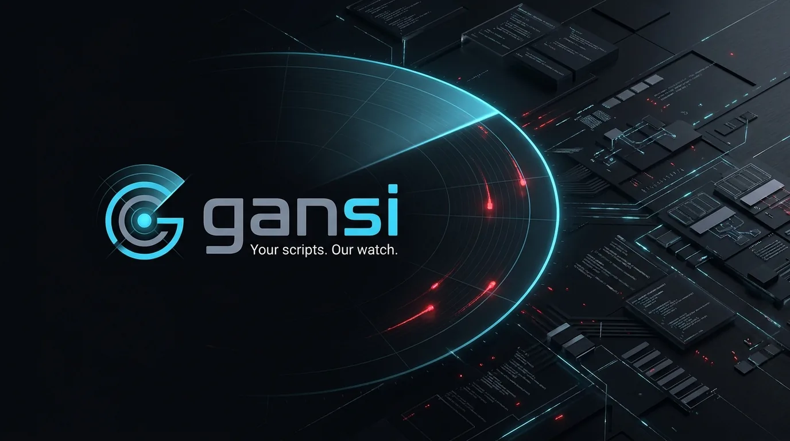
</p>

---

## What Gansi is (and is not)

### Is

| Capability | Description |
|------------|-------------|
| AMSI provider | Implements `IAntimalwareProvider2` as an in-process COM server (`gansi_com.dll`) |
| Local telemetry | Streams findings to `\\.\pipe\<suffix>` for operator consumption |
| Script awareness | PowerShell parse path + C# extraction + heuristic fallback |
| Operator CLI | Polished `gansi` binary for lifecycle, live event stream, and Defender management |
| Research tooling | Transparent heuristics, compile-time keyword tables, extensible cleanlist |

### Is not

| Misconception | Reality |
|---------------|---------|
| Cloud EDR / XDR | No cloud backend, no fleet console, no remote agents |
| Full antivirus replacement | Does not replace Defender or commercial AV; coexists as an additional AMSI provider |
| Guaranteed block engine | Default path is **report without blocking** for Detected/Suspicious |
| Cross-platform | Windows-only (COM, AMSI, named pipes, HKLM registration) |

<p align="center">
  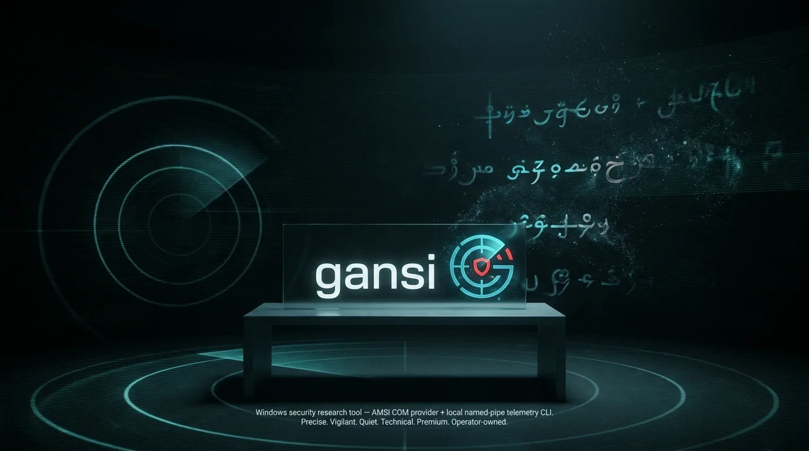
</p>

---

## What you can achieve

Gansi is built for people who need **script-path visibility** under their own control. Concrete outcomes:

### 1. See what AMSI actually receives

Many detection discussions stop at “PowerShell ran.” Gansi sits where the OS already hands script buffers to antimalware providers. You can observe:

- Application name attributes (e.g. PowerShell host identity)
- Content name / script identity when present
- Session correlation identifiers
- Full content payloads (subject to your pipe consumer and debug dump policy)

### 2. Build a lab-grade AMSI event stream

Run `gansi watch` or `gansi trace` and treat the pipe as a **local SIEM-lite feed** for script activity on that machine:

- Purple-team exercises
- Detection engineering validation
- Training environments where students trigger known-bad strings
- Regression checks when changing keyword lists

<p align="center">
  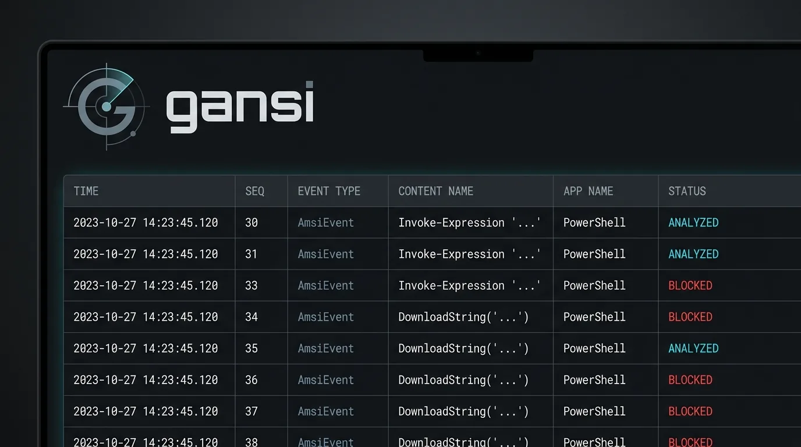
</p>

### 3. Validate bypass-shaped content without shipping a full AV product

Heuristic lists intentionally cover common AMSI-bypass and credential-tooling strings (e.g. AmsiUtils-related paths, Mimikatz invocation tokens). You can:

- Confirm that lab payloads still trip local sensors
- Diff “before/after” when hardening scripts or policies
- Teach *why* certain patterns are noisy or useful

### 4. Keep clean scripts quiet via SHA cleanlist

Known-benign snippets (hashed at compile time into a PHF set) short-circuit to **Clean**, reducing noise for repeated lab/admin content.

### 5. Own the registration lifecycle

Unlike opaque installers, Gansi exposes COM registration as first-class CLI operations:

- `gansi register` — install provider + pipe suffix in registry
- `gansi unregister` — remove AMSI provider + CLSID tree
- `gansi watch` — register for a session, auto-unregister on exit

### 6. Integrate with your own tooling

Because events are **length-prefixed JSON** over a named pipe, you can:

- Point a custom collector at the same pipe
- Forward to local logging agents
- Build dashboards without modifying the DLL

### 7. Ship a coherent operator experience

The CLI is designed for real use: subcommands, colored help, banner, structured success/error, timestamped event lines — not a throwaway research stub.

<p align="center">
  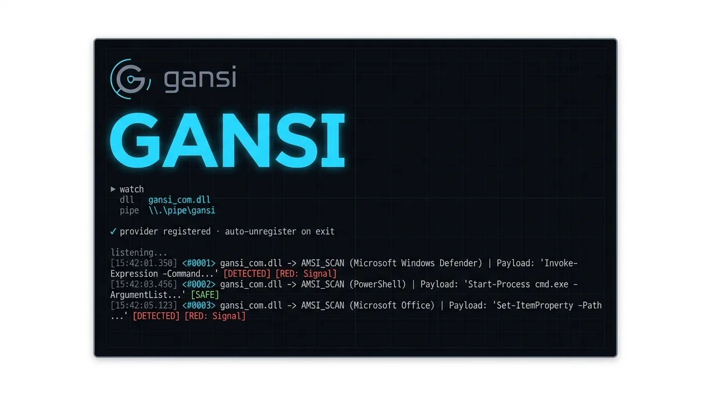
</p>

### 8. Explain the system to stakeholders

Architecture is simple enough to draw on a whiteboard and accurate enough for security reviews:

<p align="center">
  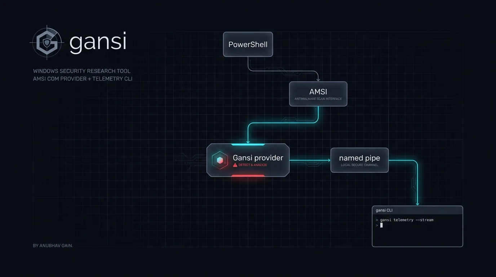
</p>

**Flow:** PowerShell / script host → **AMSI** → **Gansi provider** → named pipe → **`gansi` CLI** (or your consumer).

---

## Brand & identity

**Name:** Gansi = **G**ain + **AMSI**  
**Author:** Anubhav Gain  
**Visual system:** dark security + developer aesthetic — ink, charcoal, steel, cyan scan accent, signal red.

| Token | Hex | Role |
|-------|-----|------|
| Ink | `#0A0C10` | Canvas |
| Panel | `#141820` | Surfaces |
| Steel | `#8B95A8` | Secondary text |
| Cyan | `#3DDCFF` | Live scan / signal |
| Red | `#FF3B4A` | Detect / alert |
| White | `#F4F6F8` | Primary type |

**Mark:** monogram **G** with scan arc and protected core.

<p align="center">
  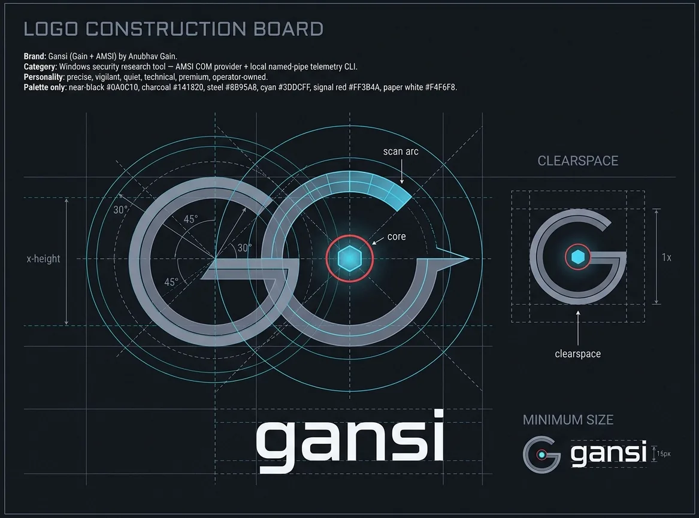
</p>

<p align="center">
  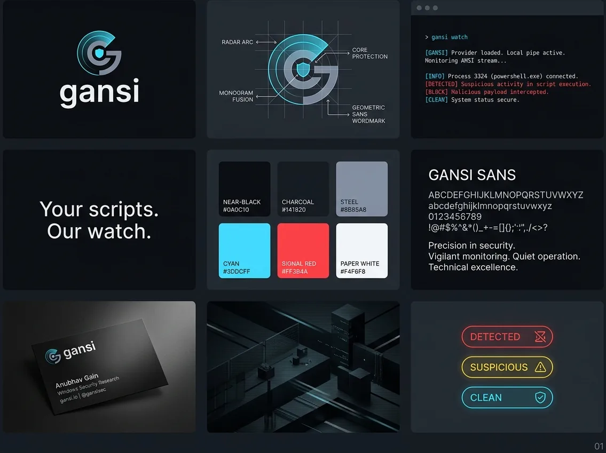
  <br />
  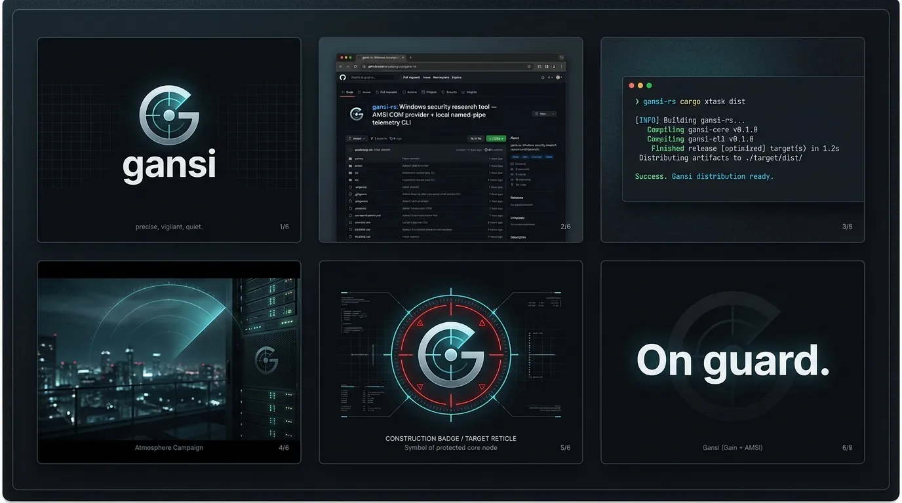
</p>

<p align="center">
  
  &nbsp;&nbsp;
  
</p>

---

## Product surfaces

| Surface | Asset | Purpose |
|---------|-------|---------|
| Docs / README cover | `docs/assets/docs-cover.webp` | Project identity |
| GitHub-style OG | `docs/assets/github-og.webp` | Social / link previews |
| Landing concept | `docs/assets/landing-hero.webp` | Product narrative |
| Launch | `docs/assets/launch-announcement.webp` | Release communication |
| Campaign poster | `docs/assets/poster-on-guard.webp` | “On guard.” |

<p align="center">
  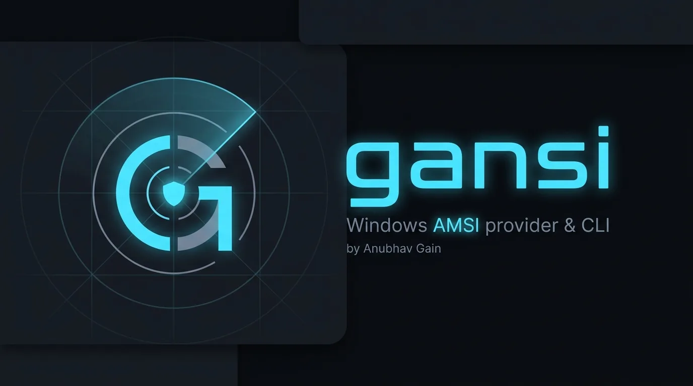
</p>

<p align="center">
  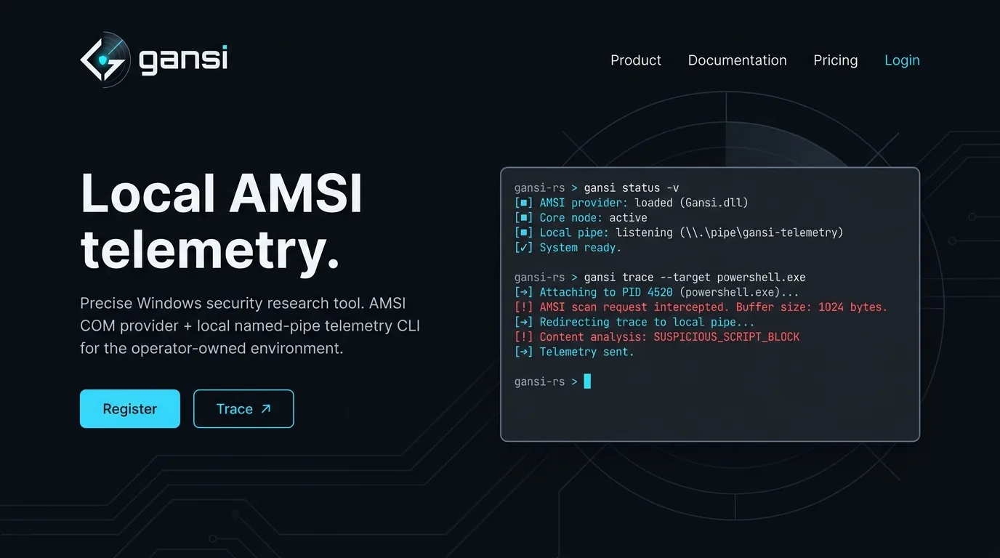
</p>

<p align="center">
  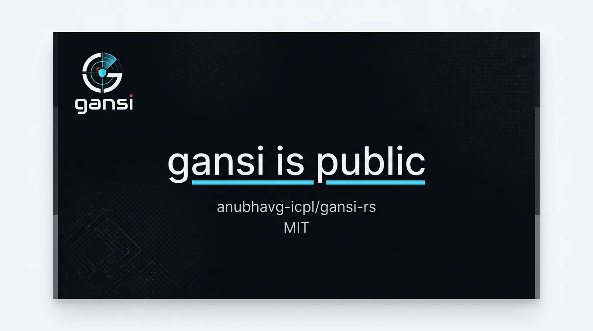
</p>

<p align="center">
  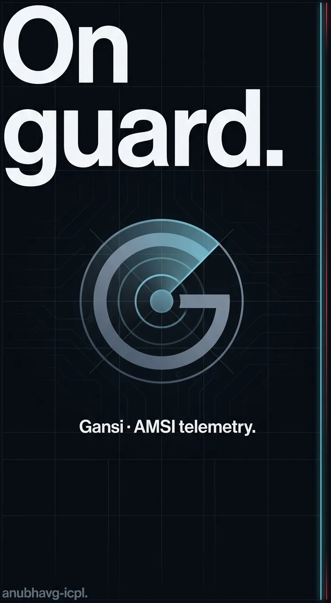
</p>

---

## Architecture

### Runtime components

```
┌─────────────────────┐     LoadLibrary / GetProcAddress
│  gansi.exe (CLI)    │──────────────────────────────────┐
│  register/trace/    │                                  │
│  watch/unregister   │                                  ▼
└──────────┬──────────┘                        ┌──────────────────┐
           │ named pipe server                 │  gansi_com.dll   │
           │ \\.\pipe\gansi                    │  COM + AMSI      │
           │ ◄──── length-prefixed JSON ───────│  IAntimalware*  │
           │                                   └────────┬─────────┘
           │                                            │
           │                                   AMSI Scan/Notify
           │                                            │
           │                                   ┌────────▼─────────┐
           │                                   │ PowerShell /     │
           │                                   │ script hosts     │
           │                                   └──────────────────┘
           ▼
    Operator terminal / custom consumer
```

### Crates

| Crate | Artifact | Responsibility |
|-------|----------|----------------|
| `gansi-com` | `gansi_com.dll` | DLL entrypoints, COM class factory, AMSI Scan, heuristics, pipe client, logging |
| `gansi-cli` | `gansi.exe` | Clap CLI, OLE init, LoadLibrary registration, named-pipe server, styled UX |
| `shared` | rlib | `GansiMessage`, `PipeName`, `FfiString`, pipe suffix constant, debug macros |
| `macros` | proc-macro | `lowercase_const_array!`, `compile_sha256_set!` |
| `xtask` | bin | `cargo xtask dist` release packaging |

### Trust boundary notes

- Registration writes **HKLM** (admin).
- The provider runs **in-process** with AMSI-consuming hosts (high sensitivity).
- The pipe ACL allows authenticated users to connect by default (lab-friendly; harden for multi-user hosts).

---

## Workspace layout

```text
gansi-rs/
├── Cargo.toml                 # workspace + shared deps
├── .cargo/config.toml         # aliases: xtask, cli
├── rustfmt.toml
├── LICENSE                    # MIT
├── README.md
├── SECURITY.md
├── docs/assets/*.webp         # brand & product imagery
├── brand/PROMPTS.md           # essential image prompts
├── gansi-cli/                 # operator CLI
├── gansi-com/                 # AMSI COM provider
├── shared/                    # protocol + FFI helpers
├── macros/                    # compile-time tables
└── xtask/                     # dist packaging
```

---

## Requirements

| Requirement | Detail |
|-------------|--------|
| OS | Windows x64 |
| Privileges | Administrator for register / unregister / watch registration path |
| Toolchain | Rust stable with **edition 2024** support |
| Build deps | MSVC toolchain / Windows SDK (for `windows` crate linking) |
| Runtime | Ability to load `gansi_com.dll` (cwd or full path) |

Linux/macOS hosts can edit sources but **cannot** exercise COM/AMSI paths.

---

## Build & package

### Debug / release build

```powershell
# Provider DLL
cargo build --release -p gansi-com

# CLI (binary name: gansi)
cargo build --release -p gansi-cli
```

Outputs (typical):

```text
target\release\gansi_com.dll
target\release\gansi.exe
```

### Dist helper

```powershell
cargo xtask dist
```

Copies release artifacts into `dist\`:

- `gansi_com.dll`
- `gansi.exe`

### Cargo aliases

```toml
# .cargo/config.toml
xtask = "run --package xtask --"
cli   = "run --package gansi-cli --"
```

Example:

```powershell
cargo cli -- watch --dll .\target\release\gansi_com.dll
```

---

## Installation & registration

> **Admin PowerShell recommended.** Registration mutates machine-wide COM and AMSI provider keys.

### Quick start (session-scoped)

```powershell
cd dist   # or target\release
.\gansi.exe watch --dll .\gansi_com.dll --pipe gansi
```

This will:

1. Initialize OLE  
2. Load the DLL  
3. Call `DllRegisterServerWithPipe`  
4. Listen on `\\.\pipe\gansi`  
5. Unregister on process exit (RAII wrapper)

### Persistent registration

```powershell
.\gansi.exe register --dll C:\path\to\gansi_com.dll --pipe gansi
# ... use system normally; trace when needed ...
.\gansi.exe trace --pipe gansi
# later
.\gansi.exe unregister --dll C:\path\to\gansi_com.dll
```

### Defaults

| Setting | Default |
|---------|---------|
| DLL path | `gansi_com.dll` |
| Pipe suffix | `gansi` → `\\.\pipe\gansi` |
| Log level | `warn` (`--log` / `GANSI_LOG`) |

---

## CLI reference

Binary: **`gansi`** (package `gansi-cli`).

```text
gansi <COMMAND>

Commands:
  register      Register the COM + AMSI provider       (alias: r)
  unregister    Unregister the COM + AMSI provider     (alias: u)
  trace         Trace AMSI events from the named pipe  (alias: t)
  watch         Register + trace (auto-unregister)     (alias: a / all)

Options:
  --log <LEVEL>   error|warn|info|debug|trace   [env: GANSI_LOG] [default: warn]
  -h, --help
  -V, --version
```

### `register`

```powershell
gansi register
gansi register --dll .\gansi_com.dll --pipe labpipe
gansi r -d C:\tools\gansi_com.dll -p gansi
```

### `unregister`

```powershell
gansi unregister
gansi unregister --dll .\gansi_com.dll
```

### `trace`

```powershell
gansi trace
gansi trace --pipe gansi
```

Does **not** register. Provider must already be present.

### `watch`

```powershell
gansi watch
gansi watch --dll .\gansi_com.dll --pipe gansi
gansi a
```

Best default for labs: one elevated process, full lifecycle, Ctrl+C to stop.

---


## Microsoft Defender management

Gansi can operate **alongside** Microsoft Defender Antivirus. The CLI exposes an admin-oriented control plane that shells out to the official **Defender PowerShell module** (`Import-Module Defender`) — the same surface documented by Microsoft (`Get-MpComputerStatus`, `Get-MpPreference`, `Set-MpPreference`, `Add-MpPreference`, `Start-MpScan`, `Update-MpSignature`, etc.).

> **Not a bypass kit.** Preference changes require elevation, may be blocked by **Tamper Protection**, **GPO/Intune**, or **MDE** policy. Disabling protections is for **lab / authorized admin** scenarios only.

### Why this exists next to AMSI

| Layer | Owner | What Gansi does |
|-------|--------|-----------------|
| AMSI providers | OS + registered COM DLLs | Gansi provider sees script buffers |
| Microsoft Defender | Platform AV | Scans files, RTP, cloud, ASR, CFA, … |
| Operator CLI | `gansi` | Register Gansi **and** query/manage Defender |

Useful outcomes:

1. **Health dashboard** before a lab session (`gansi defender health`)
2. **Signature freshness** + forced update (`gansi defender update`)
3. **On-demand scans** (quick / full / custom path)
4. **Exclusion hygiene** for lab folders (path / process / extension / IP)
5. **Threat history** review (`gansi defender threats`)
6. **Toggle visibility** into RTP, script scanning, behavior monitoring, IOAV
7. **Cloud / MAPS / CFA / Network Protection** preference view + set (policy permitting)
8. **`lab-prep`** — one shot exclusions for `gansi.exe` + `gansi_com.dll` directory

### Commands

```powershell
# Dashboard
gansi defender health

# Status / preferences
gansi defender status
gansi defender status --json
gansi defender prefs
gansi defender prefs --json

# Scans & definitions
gansi defender scan --kind quick
gansi defender scan --kind full
gansi defender scan --kind custom --path C:\Users\Public\Downloads
gansi defender update

# Threats
gansi defender threats
gansi defender threats --limit 50 --json
gansi defender catalog --filter trojan --limit 20
gansi defender remove-threats

# Exclusions
gansi defender exclude list
gansi defender exclude add --path C:\lab\gansi --process C:\lab\gansi\gansi.exe
gansi defender exclude add --extension .tmp --ip 10.0.0.5
gansi defender exclude remove --path C:\lab\gansi

# Protection toggles (admin; may be blocked)
gansi defender realtime status
gansi defender realtime on
gansi defender script-scan status
gansi defender behavior status
gansi defender ioav status

# Cloud / CFA / network protection
gansi defender cloud --show
gansi defender cloud --maps 2 --block-level 2
gansi defender cfa --show
gansi defender cfa --mode 2
gansi defender netprot --show

# Lab helper for this project
gansi defender lab-prep --dir .\dist
```

### Implementation notes

- Backend: `powershell.exe -NoProfile -NonInteractive` + `ConvertTo-Json`
- Module: `Defender` (built into Windows client/server with Defender AV)
- Failures surface stderr from PowerShell (policy, missing module, non-Windows)
- Gansi does **not** replace Defender; it coexists as an additional AMSI provider

### Recommended lab sequence

```powershell
# elevated
gansi defender health
gansi defender lab-prep --dir $PWD\dist
gansi watch --dll .\dist\gansi_com.dll
# exercise scripts in another window
# Ctrl+C
gansi defender exclude remove --path $PWD\dist
```


## Operational workflows

### Purple team / detection lab

1. Elevate shell.  
2. `gansi watch`.  
3. In another window, run test scripts (benign + known-noisy).  
4. Observe event stream; refine keyword lists if needed.  
5. Exit watch → auto-unregister.

### Silent registration + scheduled trace

1. `gansi register` once on a lab VM.  
2. Start `gansi trace` when collecting.  
3. Keep DLL path stable (InProcServer32 points at registered module path).

### CI-minded packaging (Windows runner)

1. `cargo xtask dist`  
2. Artifact `dist\` folder  
3. Manual or scripted smoke: register → generate event → unregister  

*(Full AMSI host interaction still requires a real Windows image.)*

---

## Scan pipeline

Inside `gansi-com`, `Scan` roughly does:

```text
content
  │
  ├─► SHA-256 cleanlist hit? ──yes──► AMSI_RESULT_CLEAN
  │
  ├─► PowerShell parse (command/script) or C# via Add-Type
  │     └─ on failure: tokenizer fallback
  │
  └─► Heuristics
        ├─ blacklist keywords / endswith / functions  → Detected
        ├─ telemetry strings / functions / types     → Suspicious
        └─ PS v2 / unknown version                   → Suspicious
              │
              └─ Detected|Suspicious → report_script (pipe)
                 return AMSI_RESULT_NOT_DETECTED  (passive default)
```

### Why passive default?

Research and monitoring scenarios often need **visibility without changing host execution outcomes**. Blocking can be re-enabled by returning `AMSI_RESULT_DETECTED` for `ScanStatus::Detected` if you accept that product decision.

### Keyword & cleanlist engineering

- Keywords are lowercased at compile time (`lowercase_const_array!`).  
- Clean SHA-256 digests are embedded in a perfect hash set (`compile_sha256_set!` + `phf`).  
- Unit tests cover macro lowercasing and set membership.

---

## IPC protocol

### Framing

| Field | Type | Notes |
|-------|------|-------|
| length | `u64` LE | Byte length of JSON body |
| body | UTF-8 JSON | `GansiMessage` |

### Message type (`shared`)

```rust
pub struct GansiMessage {
    message: String,
}
```

Display form is the inner message string (human-readable event summary).

### Pipe name

```text
\\.\pipe\{suffix}
```

Default suffix: `gansi`. Validated by `PipeName::verify` (forbidden characters, length, control chars).

---

## Registry surface

Registration (simplified):

| Key | Purpose |
|-----|---------|
| `HKLM\Software\Classes\CLSID\{IGansi IID}` | COM class, default name, `pipe` value |
| `...\CLSID\{IID}\InProcServer32` | DLL path, `ThreadingModel=Both` |
| `HKLM\Software\Microsoft\AMSI\Providers\{IID}` | AMSI provider registration |

Unregister deletes the AMSI provider key and CLSID tree.

> **Note:** CLSID is fixed in source (`IGansi` interface attribute). Treat it as part of the ABI for a given major version.

---

## Security model & threat considerations

### Sensitive by design

| Area | Consideration |
|------|----------------|
| In-process provider | Faults/crashes can affect hosts that load AMSI providers |
| Script content | May contain secrets; pipe and optional disk dumps are sensitive |
| HKLM writes | Requires admin; malware-shaped abuse is possible if an attacker already has admin |
| Pipe ACL | Default SDDL allows Authenticated Users R/W; tighten for shared workstations |
| Logging | Provider may log under `C:\gansi` (configure/harden in production forks) |

### Recommended lab hardening

1. Use disposable VMs.  
2. Restrict pipe ACL to admins only if multi-user.  
3. Disable or gate debug content dumps.  
4. Code-sign DLL/CLI if distributing outside a lab.  
5. Prefer `watch` over permanent registration when possible.

See [SECURITY.md](SECURITY.md) for reporting guidance.

---

## Use cases (depth)

### Detection engineering

- Confirm AMSI still sees content after obfuscation layers.  
- Compare provider output with 4688/ScriptBlock logs.  
- Build regression packs: “these 20 payloads must produce events.”

### Red team (defensive awareness)

- Understand which strings trip local heuristics.  
- Exercise OPSEC against *your* sensor before client delivery.  
- Not a bypass toolkit — lists exist to *catch* common patterns.

### Blue team / SOC lab

- Live demo of script telemetry without cloud agents.  
- Training: map event fields to investigation steps.  
- Validate that “clean admin scripts” stay quiet via cleanlist.

### Research & education

- Teach COM registration, AMSI provider model, named pipes.  
- Rust systems example: `windows` crate, `cdylib`, FFI strings.  
- Transparent, auditable alternative to closed demo tools.

### Product / platform teams

- Spike for “local script sensor” product shape.  
- Reference architecture for pipe-based control planes.  
- Brand-ready open source face for security engineering culture.

---

## Limitations & non-goals

| Topic | Status |
|-------|--------|
| Non-Windows | Out of scope |
| Kernel callbacks | Not used |
| Memory scanning beyond AMSI buffers | Not a goal |
| Perfect deobfuscation | Best-effort parse + tokens |
| Multi-machine fleet | No orchestration layer |
| Guaranteed prevention | Passive default |
| Stable machine-wide policy UI | CLI only |

---

## Roadmap-minded extensions

Ideas for forks / future work (not promises):

- Optional hard-block mode behind a flag  
- Configurable log/dump directories  
- Stronger pipe ACL presets  
- JSON schema versioning for `GansiMessage`  
- YARA or additional engines behind the same provider façade  
- ETW mirror of pipe events  
- Signed releases + SBOM  

---

## Development notes

### Workspace membership

All of `gansi-cli`, `gansi-com`, `shared`, `macros`, `xtask` are workspace members so `workspace = true` deps resolve cleanly.

### Logging

| Component | Mechanism |
|-----------|-----------|
| CLI | `env_logger` via `--log` / `GANSI_LOG` |
| DLL | `fern` file logging (process-oriented) + `OutputDebugString` macros |

### Code map (provider)

```text
gansi-com/src/
  lib.rs                 DllMain, register/unregister exports
  gansi.rs               COM object, class factory, logging init
  gansi/antimalware.rs   IAntimalwareProvider(2) impl
  gansi/attribute.rs     AMSI stream attributes / content
  gansi/scan.rs          cleanlist + heuristics
  gansi/keywords.rs      lists + macro tests
  gansi/report.rs        event build + pipe send
  gansi/report/pipe_client.rs
  amsi_utils/            event model, process info, string helpers
  winapi.rs              module path, PEB cmdline helpers
```

### Code map (CLI)

```text
gansi-cli/src/
  main.rs         clap commands + async trace loop
  ui.rs           banner, kv, event_line, styles
  com_wrapper.rs  OLE + LoadLibrary + export calls
  pipe_server.rs  named pipe server + SDDL + framing
```

---

## Assets

Brand and product imagery lives in [`docs/assets/`](docs/assets/) as **WebP** (optimized from source stills).

| File | Use |
|------|-----|
| `logo-primary.webp` | Primary lockup |
| `logo-construction.webp` | Construction board |
| `app-icon.webp` | App / tray mark |
| `social-avatar.webp` | Avatar |
| `brand-kit-3x3.webp` | Full kit board |
| `brand-kit-2x3.webp` | Compact deck |
| `terminal-cli.webp` | CLI hero |
| `github-og.webp` | OG / social card |
| `hero-banner.webp` | Wide hero |
| `security-atmosphere.webp` | Mood |
| `amsi-diagram.webp` | Architecture art |
| `poster-on-guard.webp` | Campaign poster |
| `docs-cover.webp` | Docs cover |
| `event-stream.webp` | Event UI concept |
| `landing-hero.webp` | Landing mock |
| `launch-announcement.webp` | Launch graphic |

Prompt source of truth for regeneration: [`brand/PROMPTS.md`](brand/PROMPTS.md).

---

## License & author

**License:** [MIT](LICENSE) — Copyright (c) 2025 Anubhav Gain  

**Author:** **Anubhav Gain**  
GitHub: [@anubhavg-icpl](https://github.com/anubhavg-icpl)  
Repository: [github.com/anubhavg-icpl/gansi-rs](https://github.com/anubhavg-icpl/gansi-rs)

---

<p align="center">
  
  <br />
  <em>Your scripts. Our watch.</em>
</p>
